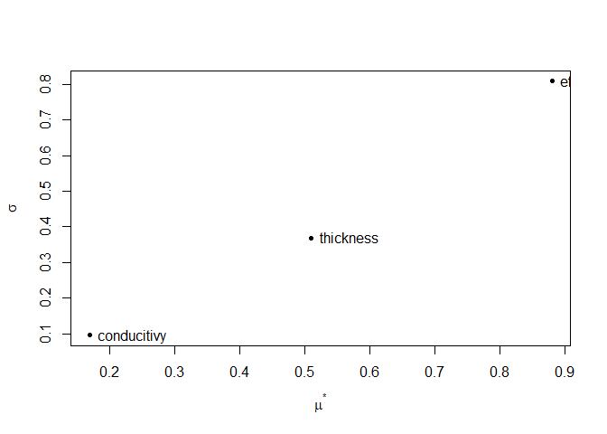

<!-- README.md is generated from README.Rmd. Please edit that file -->

# epScan

Conduct sensitivity analysis and Bayesian calibration of EnergyPlus
models.

[](https://travis-ci.com/ideas-lab-nus/epScan)
[](https://codecov.io/gh/ideas-lab-nus/epScan)
[](https://cran.r-project.org/package=epScan)
[](https://cran.r-project.org/package=epScan)

## Installation

Currently, epScan is not on CRAN. You can install the development
version from GitHub.

``` r
# install.packages("remotes")
remotes::install_github("ideas-lab-nus/epScan")
```

# Get started

## Sensitivity Analysis

Create a `SensitivityJob` object:

``` r
# use an example file from EnergyPlus v8.8 for demonstration here
path_idf <- file.path(eplusr::eplus_config(8.8)$dir, "ExampleFiles", "5Zone_Transformer.idf")
path_epw <- file.path(eplusr::eplus_config(8.8)$dir, "WeatherData", "USA_CA_San.Francisco.Intl.AP.724940_TMY3.epw")

# create a `SensitivityJob` class which inheris from eplusr::ParametricJob class
sen <- sensi_job(path_idf, path_epw)
#> IDD v8.8.0 has not been parsed before.
#> Try to locate `Energy+.idd` in EnergyPlus v8.8.0 installation folder `/usr/local/EnergyPlus-8-8-0`.
#> IDD file found: `/usr/local/EnergyPlus-8-8-0/Energy+.idd`.
#> Start parsing...
#> Parsing completed.
#> Adding an object in class `Output:SQLite` and setting its `Option Type` to `SimpleAndTabular` in order to create SQLite output file.
```

Set sensitivity parameters using `$param()` or `$apply_measure()`.

  - Using `$param()`

<!-- end list -->

``` r
# set parameter using similar syntax to `Idf$set()` in eplusr
sen$param(
    # For adding a single object field as parameter
    # Syntax: Object = list(Field = c(Min, Max, Levels))
    `Supply Fan 1` = list(Fan_Total_Efficiency = c(0.1, 1.0, 5)),

    # For adding a class field as parameter
    Material := list(
        Thickness = c(min = 0.01, max = 0.08, levels = 5),
        Conductivity = c(min = 0.01, max = 0.6, levels = 6)
    ),

    # use `.names` to give names to each parameter
    .names = c("efficiency", "thickness", "conducitivy"),

    # See `r` and `grid_jump` in `sensitivity::morris`
    .r = 8, .grid_jump = 1
)
```

  - Using `$apply_measure()`

<!-- end list -->

``` r
# first define a "measure"
my_actions <- function (idf, efficiency, thickness, conducitivy) {
    idf$set(
        `Supply Fan 1` = list(Fan_Total_Efficiency = efficiency),
        Material := list(Thickness = thickness, Conductivity = conducitivy)
    )

    idf
}

# then apply that measure with parameter space definitions as function arguments
sen$apply_measure(my_actions,
    efficiency = c(0.1, 1.0, 5),
    thickness = c(0.01, 0.08, 5),
    conducitivy = c(0.1, 0.6, 6),
    .r = 8, .grid_jump = 1
)
#> ── EnergPlus Parametric Job ───────────────────────────────────────────────
#> Seed Model: `/usr/local/EnergyPlus-8-8-0/ExampleFiles/5Zone_Transforme...
#> Weather: `/usr/local/EnergyPlus-8-8-0/WeatherData/USA_CA_San.Francisco...
#> EnergyPlus Version: `8.8.0`
#> EnergyPlus Path: `/usr/local/EnergyPlus-8-8-0`
#> Applied Measure: `my_actions`
#> Parametric Models [32]: 
#> [01]: `1_effic(0.775)_thick(0.01)_condu(0.3)`
#> [02]: `2_effic(0.775)_thick(0.01)_condu(0.2)`
#> [03]: `3_effic(0.775)_thick(0.0275)_condu(0.2)`
#> [04]: `4_effic(1)_thick(0.0275)_condu(0.2)`
#> [05]: `5_effic(0.325)_thick(0.08)_condu(0.6)`
#> [06]: `6_effic(0.1)_thick(0.08)_condu(0.6)`
#> [07]: `7_effic(0.1)_thick(0.0625)_condu(0.6)`
#> [08]: `8_effic(0.1)_thick(0.0625)_condu(0.5)`
#> [09]: `9_effic(1)_thick(0.0275)_condu(0.4)`
#> [10]: `10_effic(1)_thick(0.01)_condu(0.4)`
#> [11]: `11_effic(1)_thick(0.01)_condu(0.5)`
#> [12]: `12_effic(0.775)_thick(0.01)_condu(0.5)`
#> [13]: `13_effic(1)_thick(0.08)_condu(0.5)`
....
```

Get samples

``` r
sen$samples()
#>     case efficiency thickness conducitivy
#>  1:    1      0.775    0.0100         0.3
#>  2:    2      0.775    0.0100         0.2
#>  3:    3      0.775    0.0275         0.2
#>  4:    4      1.000    0.0275         0.2
#>  5:    5      0.325    0.0800         0.6
#>  6:    6      0.100    0.0800         0.6
#>  7:    7      0.100    0.0625         0.6
#>  8:    8      0.100    0.0625         0.5
#>  9:    9      1.000    0.0275         0.4
#> 10:   10      1.000    0.0100         0.4
#> 11:   11      1.000    0.0100         0.5
#> 12:   12      0.775    0.0100         0.5
#> 13:   13      1.000    0.0800         0.5
#> 14:   14      0.775    0.0800         0.5
#> 15:   15      0.775    0.0625         0.5
#> 16:   16      0.775    0.0625         0.4
#> 17:   17      0.775    0.0800         0.1
#> 18:   18      1.000    0.0800         0.1
#> 19:   19      1.000    0.0625         0.1
....
```

Run simulations and calculate statistic indicators

``` r
# run simulations in temporary directory
sen$run(dir = tempdir(), echo = FALSE)
#> ── EnergPlus Parametric Job ───────────────────────────────────────────────
#> Seed Model: `/usr/local/EnergyPlus-8-8-0/ExampleFiles/5Zone_Transforme...
#> Weather: `/usr/local/EnergyPlus-8-8-0/WeatherData/USA_CA_San.Francisco...
#> EnergyPlus Version: `8.8.0`
#> EnergyPlus Path: `/usr/local/EnergyPlus-8-8-0`
#> Applied Measure: `my_actions`
#> Parametric Models [32]: 
#> [01]: `1_effic(0.775)_thick(0.01)_condu(0.3)`    <-- SUCCEEDED
#> [02]: `2_effic(0.775)_thick(0.01)_condu(0.2)`    <-- SUCCEEDED
#> [03]: `3_effic(0.775)_thick(0.0275)_condu(0.2)`  <-- SUCCEEDED
#> [04]: `4_effic(1)_thick(0.0275)_condu(0.2)`      <-- SUCCEEDED
#> [05]: `5_effic(0.325)_thick(0.08)_condu(0.6)`    <-- SUCCEEDED
#> [06]: `6_effic(0.1)_thick(0.08)_condu(0.6)`      <-- SUCCEEDED
#> [07]: `7_effic(0.1)_thick(0.0625)_condu(0.6)`    <-- SUCCEEDED
#> [08]: `8_effic(0.1)_thick(0.0625)_condu(0.5)`    <-- SUCCEEDED
#> [09]: `9_effic(1)_thick(0.0275)_condu(0.4)`      <-- SUCCEEDED
#> [10]: `10_effic(1)_thick(0.01)_condu(0.4)`       <-- SUCCEEDED
#> [11]: `11_effic(1)_thick(0.01)_condu(0.5)`       <-- SUCCEEDED
#> [12]: `12_effic(0.775)_thick(0.01)_condu(0.5)`   <-- SUCCEEDED
#> [13]: `13_effic(1)_thick(0.08)_condu(0.5)`       <-- SUCCEEDED
....

# extract output
# here is just am example
eng <- sen$tabular_data(table_name = "site and source energy",
    column_name = "energy per total building area",
    row_name = "total site energy")[, as.numeric(value)]

# calculate sensitivity
(result <- sen$evaluate(eng))
#> 
#> Call:
#> sensitivity::morris(model = NULL, factors = fctr, r = r, design = list(type = "oat",     levels = par$num$meta$levels, grid.jump = grid_jump), binf = par$num$meta$min,     bsup = par$num$meta$max, scale = FALSE)
#> 
#> Model runs: 32 
#>                    mu  mu.star     sigma
#> efficiency  -0.500000 0.500000 0.7956673
#> thickness   -7.071429 7.071429 4.7607482
#> conducitivy  0.400000 0.400000 0.2449490

# extract data
attr(result, "data")
#>    index        name        mu  mu.star     sigma
#> 1:     1  efficiency -0.500000 0.500000 0.7956673
#> 2:     2   thickness -7.071429 7.071429 4.7607482
#> 3:     3 conducitivy  0.400000 0.400000 0.2449490
```

Plot

``` r
# plot
plot(result)
```

<!-- -->

## Bayesian Calibration

Create a `BayesCalibJob` object:

``` r
# use an example file from EnergyPlus v8.8 for demonstration here
path_idf <- file.path(eplusr::eplus_config(8.8)$dir, "ExampleFiles", "RefBldgLargeOfficeNew2004_Chicago.idf")
path_epw <- file.path(eplusr::eplus_config(8.8)$dir, "WeatherData", "USA_CA_San.Francisco.Intl.AP.724940_TMY3.epw")

# create a `SensitivityJob` class which inheris from eplusr::ParametricJob class
bc <- bayes_job(path_idf, path_epw)
```

### Get RDD and MDD

`$read_rdd()` and `$read_mdd()` can be used to get RDD and MDD for
current seed model.

``` r
(rdd <- bc$read_rdd())
#> Initializing RDD...
#> Initializing RDD... [SUCCESSFUL]
#> ══ EnergyPlus Report Data Dictionary File ═════════════════════════════════
#>   * EnergyPlus version: 8.8.0 (7c3bbe4830)
#>   * Simulation started: 2019-09-13 03:57:00
#> 
#> ── Details ────────────────────────────────────────────────────────────────
#>      index reported_time_step report_type
#>   1:     1               Zone     Average
#>   2:     2               Zone     Average
#>   3:     3               Zone     Average
#>   4:     4               Zone     Average
#>   5:     5               Zone     Average
#>  ---                                     
#> 616:   616               HVAC     Average
#> 617:   617               HVAC         Sum
#> 618:   618               HVAC     Average
#> 619:   619               HVAC         Sum
#> 620:   620               HVAC     Average
#>                                                           variable
#>   1:                          Site Outdoor Air Drybulb Temperature
#>   2:                         Site Outdoor Air Dewpoint Temperature
....
(mdd <- bc$read_mdd())
#> ══ EnergyPlus Meter Data Dictionary File ══════════════════════════════════
#>   * EnergyPlus version: 8.8.0 (7c3bbe4830)
#>   * Simulation started: 2019-09-13 03:57:00
#> 
#> ── Details ────────────────────────────────────────────────────────────────
#>      index reported_time_step report_type
#>   1:     1               Zone       Meter
#>   2:     2               Zone       Meter
#>   3:     3               Zone       Meter
#>   4:     4               Zone       Meter
#>   5:     5               Zone       Meter
#>  ---                                     
#> 173:   173               Zone       Meter
#> 174:   174               Zone       Meter
#> 175:   175               Zone       Meter
#> 176:   176               Zone       Meter
#> 177:   177               Zone       Meter
#>                                         variable units
#>   1:                        Electricity:Facility     J
#>   2:                        Electricity:Building     J
....
```

### Setting Input and Output Variables

Input variables and output variables can be set by using `$input()` and
`$output()`, respectively. For `$input()`, only variables listed in RDD
are supported. For `$output()`, variables listed in RDD and MDD are both
supported.

By default, they are all empty and `$input()`, `$output()` will return
`NULL`.

``` r
bc$input()
#> NULL
bc$output()
#> NULL
bc$models()
#> Unable to create parametric models because input variables are not set. Please use `$input()` to set input variables.
```

You can specify input and output parameters using `RddFile`, `MddFile`
and data.frames.

``` r
# using RDD and MDD
bc$input(rdd[1:3])
#>    index           class key_value                         variable_name
#> 1:     1 Output:Variable         *  Site Outdoor Air Drybulb Temperature
#> 2:     2 Output:Variable         * Site Outdoor Air Dewpoint Temperature
#> 3:     3 Output:Variable         *  Site Outdoor Air Wetbulb Temperature
#>    reporting_frequency
#> 1:            Timestep
#> 2:            Timestep
#> 3:            Timestep
bc$output(mdd[1:3])
#>    index        class key_value             variable_name
#> 1:     1 Output:Meter      <NA>      Electricity:Facility
#> 2:     2 Output:Meter      <NA>      Electricity:Building
#> 3:     3 Output:Meter      <NA> Electricity:Zone:BASEMENT
#>    reporting_frequency
#> 1:            Timestep
#> 2:            Timestep
#> 3:            Timestep

# using data.frame
bc$input(eplusr::rdd_to_load(rdd[1:3]))
#>    index           class key_value                         variable_name
#> 1:     1 Output:Variable         *  Site Outdoor Air Drybulb Temperature
#> 2:     2 Output:Variable         * Site Outdoor Air Dewpoint Temperature
#> 3:     3 Output:Variable         *  Site Outdoor Air Wetbulb Temperature
#>    reporting_frequency
#> 1:            Timestep
#> 2:            Timestep
#> 3:            Timestep
bc$output(eplusr::mdd_to_load(mdd[1:3]))
#>    index        class key_value             variable_name
#> 1:     1 Output:Meter      <NA>      Electricity:Facility
#> 2:     2 Output:Meter      <NA>      Electricity:Building
#> 3:     3 Output:Meter      <NA> Electricity:Zone:BASEMENT
#>    reporting_frequency
#> 1:            Timestep
#> 2:            Timestep
#> 3:            Timestep
```

You can set `append` to `NULL` to remove all existing input and output
parameters.

``` r
bc$input(append = NULL)
#> NULL
bc$output(append = NULL)
#> NULL
```

You can also directly specify variable names:

``` r
bc$input(
    name = c(
        "site outdoor air drybulb temperature",
        "site outdoor air relative humidity",
        "site direct solar radiation rate per area",
        "chiller electric power",
        "chiller evaporator inlet temperature",
        "chiller evaporator outlet temperature",
        "chiller evaporator mass flow rate",
        "fan air mass flow rate"
    ),
    reporting_frequency = "hourly"
)
#>    index           class key_value
#> 1:     1 Output:Variable         *
#> 2:     2 Output:Variable         *
#> 3:     3 Output:Variable         *
#> 4:     4 Output:Variable         *
#> 5:     5 Output:Variable         *
#> 6:     6 Output:Variable         *
#> 7:     7 Output:Variable         *
#> 8:     8 Output:Variable         *
#>                                variable_name reporting_frequency
#> 1:      Site Outdoor Air Drybulb Temperature              Hourly
#> 2:        Site Outdoor Air Relative Humidity              Hourly
#> 3: Site Direct Solar Radiation Rate per Area              Hourly
#> 4:                    Chiller Electric Power              Hourly
#> 5:      Chiller Evaporator Inlet Temperature              Hourly
#> 6:     Chiller Evaporator Outlet Temperature              Hourly
#> 7:         Chiller Evaporator Mass Flow Rate              Hourly
#> 8:                    Fan Air Mass Flow Rate              Hourly
bc$output(
    name = c(
        "Electricity:Building",
        "InteriorLights:Electricity",
        "InteriorEquipment:Electricity",
        "Cooling:Electricity",
        "Heating:Electricity",
        "Heating:Gas",
        "Fans:Electricity"
    ),
    reporting_frequency = "hourly"
)
#>    index        class key_value                 variable_name
#> 1:     1 Output:Meter      <NA>          Electricity:Building
#> 2:     2 Output:Meter      <NA>    InteriorLights:Electricity
#> 3:     3 Output:Meter      <NA> InteriorEquipment:Electricity
#> 4:     4 Output:Meter      <NA>           Cooling:Electricity
#> 5:     5 Output:Meter      <NA>           Heating:Electricity
#> 6:     6 Output:Meter      <NA>                   Heating:Gas
#> 7:     7 Output:Meter      <NA>              Fans:Electricity
#>    reporting_frequency
#> 1:              Hourly
#> 2:              Hourly
#> 3:              Hourly
#> 4:              Hourly
#> 5:              Hourly
#> 6:              Hourly
#> 7:              Hourly
```

Note that variable cannot be set as both an input and output variable.

``` r
bc$output(name = "fan air mass flow rate", reporting_frequency = "hourly")
#> Error: Variables specified have already been set as input: `*:Fan Air Mass Flow Rate`
```

Also, note that input and output variables should have the same
reporting frequency.

``` r
bc$output(mdd[1], reporting_frequency = "daily")
#> Error: Object specified does not have the same reporting frequency as existing input (`Hourly`). Invalid input reporting frequency: `daily`
```

For `$output()`, both variables in RDD and MDD are supported. However,
for `$input()`, only varaibles in RDD are allowed.

### Adding Parameters to Calibrate

Similarly like `SensitivityJob`, parameters can be added using either
`$param()` or `$apply_measure()`.

Here use `$param()` for demonstration. Basically there are 3 format of
defining a parameter:

  - `object = list(field1 = c(min, max), field2 = c(min, max), ...)`
    
    This is the basic format. `field1` and `field2` in `object` will be
    added as two different parameters, with minimum and maximum value
    specified as `min` and `max`.

  - `class := list(field1 = c(min, max), field2 = c(min, max), ...)`
    
    This is useful when you want to treat `field1` and `field2` in all
    objects in `class` as two differnet parameters. Please note the use
    of special notion of `:=` instead of `=`.

  - `.(objects) := list(field1 = c(min, max), field2 = c(min, max),
    ...)`
    
    Sometimes you may not want to treat a field in all objects in a
    class but only a subset of objects. You can use a special notation
    on the left hand side `.()`. In the parentheses can be object names
    or IDs.

<!-- end list -->

``` r
bc$param(
    ZoneInfiltration_DesignFlowRate := list(flow_per_exterior_surface_area = c(0.0003, 0.001)),
    Lights := list(watts_per_zone_floor_area = c(5, 20)),
    .("Core_bottom People", "Core_mid People", "Core_top People") := list(
      zone_floor_area_per_person = c(5, 15)
    ),
    ElectricEquipment := list(watts_per_zone_floor_area = c(5, 20)),
    `CoolSys1 Chiller 1` = list(reference_cop = c(1, 5)),
    `CoolSys1 Chiller 2` = list(reference_cop = c(1, 5)),
    VAV_1_Fan = list(fan_total_efficiency = c(0.1, 0.9)),
    VAV_2_Fan = list(fan_total_efficiency = c(0.1, 0.9)),
    list(
      VAV_3_Fan = list(fan_total_efficiency = c(0.1, 0.9)),
      VAV_5_Fan = list(fan_total_efficiency = c(0.1, 0.9))
    ),

    .names = c("infil_rate", "lights", "people", "equipment", "chiller1cop",
      "chiller2cop", "fan1eff", "fan2eff", "fan3eff", "fan5eff"
    ),

    .num_sim = 2L
)
#> ── EnergPlus Parametric Job ───────────────────────────────────────────────
#> Seed Model: `/usr/local/EnergyPlus-8-8-0/ExampleFiles/RefBldgLargeOffi...
#> Weather: `/usr/local/EnergyPlus-8-8-0/WeatherData/USA_CA_San.Francisco...
#> EnergyPlus Version: `8.8.0`
#> EnergyPlus Path: `/usr/local/EnergyPlus-8-8-0`
#> Applied Measure: ``
#> Parametric Models [2]: 
#> [1]: `1_chiller1(3.269508)_chiller2(1.8782)_equip(6.568681)_fan1e(0.4158435)_fan2e(0.1973639)_fan3e(0.`
#> [2]: `2_chiller1(2.548999)_chiller2(3.150411)_equip(17.37916)_fan1e(0.8259226)_fan2e(0.5983446)_fan3e(`
#> << Job has not been run before >>
```

### Getting Sample Values and Parametric Models

Parameter values can be retrieved using `$samples()`.

``` r
bc$samples()
#>    case chiller1cop chiller2cop equipment   fan1eff   fan2eff   fan3eff
#> 1:    1    3.269508    1.878200  6.568681 0.4158435 0.1973639 0.6244455
#> 2:    2    2.548999    3.150411 17.379161 0.8259226 0.5983446 0.1711960
#>      fan5eff   infil_rate   lights    people
#> 1: 0.4309617 0.0007684997  5.05934 13.319322
#> 2: 0.8508381 0.0006475060 18.54624  8.491197
```

Generated `Idf`s can be retrieved using `$models()`.

``` r
names(bc$models())
#> [1] "1_chiller1(3.269508)_chiller2(1.8782)_equip(6.568681)_fan1e(0.4158435)_fan2e(0.1973639)_fan3e(0."
#> [2] "2_chiller1(2.548999)_chiller2(3.150411)_equip(17.37916)_fan1e(0.8259226)_fan2e(0.5983446)_fan3e("
```

### Run simulations and gather data

`$eplus_run()` runs all parametric models in parallel. Parameter
`run_period` can be given to insert a new `RunPeriod` object. In this
case, all existing `RunPeriod` objects in the seed model will be
commented out.

``` r
bc$eplus_run(dir = tempdir(), run_period = list("example", 1, 1, 1, 7), echo = FALSE)
#> Reset `Run Simulation for Weather File Run Periods` in `SimulationControl` from `No` to `Yes` to make sure input run period can take effect.
#> Reset `Run Simulation for Weather File Run Periods` in `SimulationControl` from `No` to `Yes` to make sure input run period can take effect.
#> ── EnergPlus Parametric Job ───────────────────────────────────────────────
#> Seed Model: `/usr/local/EnergyPlus-8-8-0/ExampleFiles/RefBldgLargeOffi...
#> Weather: `/usr/local/EnergyPlus-8-8-0/WeatherData/USA_CA_San.Francisco...
#> EnergyPlus Version: `8.8.0`
#> EnergyPlus Path: `/usr/local/EnergyPlus-8-8-0`
#> Applied Measure: ``
#> Parametric Models [2]: 
#> [1]: `1_chiller1(3.269508)_chiller2(1.8782)_equip(6.568681)_fan1e(0.4158435)_fan2e(0.1973639)_fan3e(0.` <-- SUCCEEDED
#> [2]: `2_chiller1(2.548999)_chiller2(3.150411)_equip(17.37916)_fan1e(0.8259226)_fan2e(0.5983446)_fan3e(` <-- SUCCEEDED
#>  Simulation started at `2019-09-13 03:57:09` and completed successfully after 23.51 secs.
```

`$data_sim()` returns a `data.table` (when `merge` is `TRUE`) or a list
of 2 `data.table` (when `merge` is `FALSE`) which contains the simulated
data of input and output parameters. These data will be stored
internally and used during Bayesian calibration using Stan.

The `resolution` parameter can be used to specify the time resolution of
returned data. Note that input time resolution cannot be smaller than
the reporting frequency, otherwise an error will be issued.

``` r
bc$data_sim("1 min")
#> Error: Input resolution should not be smaller than reporting frequency (1 hour). Invalid resolution found: `1 min`
```

``` r
bc$data_sim()
#> $input
#>          Date/Time
#>   1:  01/01  01:00
#>   2:  01/01  02:00
#>   3:  01/01  03:00
#>   4:  01/01  04:00
#>   5:  01/01  05:00
#>  ---              
#> 332:  01/07  20:00
#> 333:  01/07  21:00
#> 334:  01/07  22:00
#> 335:  01/07  23:00
#> 336:  01/07  24:00
#>      Environment:Site Outdoor Air Drybulb Temperature [C](Hourly)
#>   1:                                                     6.991667
#>   2:                                                     7.200000
#>   3:                                                     6.908333
#>   4:                                                     6.350000
#>   5:                                                     5.108333
#>  ---                                                             
....
```

### Specify Measured Data

`$data_field()` takes a `data.frame` of measured value of output
parameters and returns a list of `data.table`s which contains the
measured value of input and output parameters, and newly measured value
of input if applicable.

For input parameters, the values of simulation data for the first case
are directly used as the measured values.

For demonstration, we use the seed model to generate fake measured
output data.

``` r
# clone the seed model
seed <- bc$seed()$clone()
# remove existing RunPeriod objects
seed$RunPeriod <- NULL
# set run period as the same as in `$eplus_run()`
seed$add(RunPeriod = list("test", 1, 1, 1, 7))
#> $test
#> <IdfObject: `RunPeriod`> [ID:857] `test`
#> Class: <RunPeriod>
#> ├─ 01: "test",           !- Name
#> │─ 02: 1,                !- Begin Month
#> │─ 03: 1,                !- Begin Day of Month
#> │─ 04: 1,                !- End Month
#> │─ 05: 7,                !- End Day of Month
#> │─ 06: "UseWeatherFile", !- Day of Week for Start Day
#> │─ 07: "Yes",            !- Use Weather File Holidays and Special Days
#> │─ 08: "Yes",            !- Use Weather File Daylight Saving Period
#> │─ 09: "No",             !- Apply Weekend Holiday Rule
#> │─ 10: "Yes",            !- Use Weather File Rain Indicators
#> └─ 11: "Yes";            !- Use Weather File Snow Indicators
seed$SimulationControl$set(
    `Run Simulation for Sizing Periods` = "No",
    `Run Simulation for Weather File Run Periods` = "Yes"
)
#> <IdfObject: `SimulationControl`> [ID:2]
#> Class: <SimulationControl>
#> ├─ 1: "YES",      !- Do Zone Sizing Calculation
#> │─ 2: "YES",      !- Do System Sizing Calculation
#> │─ 3: "YES",      !- Do Plant Sizing Calculation
#> │─ 4: "No",       !- Run Simulation for Sizing Periods
#> │─ 5: "Yes",      !- Run Simulation for Weather File Run Periods
#> │─ 6: "YES",      !- Do HVAC Sizing Simulation for Sizing Periods
#> └─ 7: 2;          !- Maximum Number of HVAC Sizing Simulation Passes
# save the model to tempdir
seed$save(tempfile(fileext = ".idf"))
job <- seed$run(path_epw, echo = FALSE)
fan_power <- job$report_data(name = bc$output()$variable_name, wide = TRUE)

bc$data_field(fan_power[, -c("case", "Date/Time")])
#> $input
#>          Date/Time
#>   1:  01/01  01:00
#>   2:  01/01  02:00
#>   3:  01/01  03:00
#>   4:  01/01  04:00
#>   5:  01/01  05:00
#>  ---              
#> 164:  01/07  20:00
#> 165:  01/07  21:00
#> 166:  01/07  22:00
#> 167:  01/07  23:00
#> 168:  01/07  24:00
#>      Environment:Site Outdoor Air Drybulb Temperature [C](Hourly)
#>   1:                                                     6.991667
#>   2:                                                     7.200000
#>   3:                                                     6.908333
#>   4:                                                     6.350000
#>   5:                                                     5.108333
#>  ---                                                             
....
```

### Run Bayesian Calibration Using Stan

``` r
options(mc.cores = parallel::detectCores())
bc$stan_run(iter = 300, chains = 3)
```
