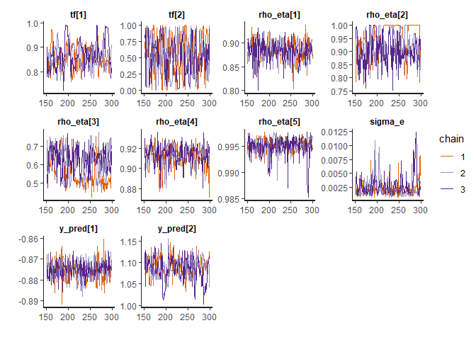

<!-- README.md is generated from README.Rmd. Please edit that file -->

# epluspar

Conduct sensitivity analysis and Bayesian calibration of EnergyPlus
models.

[](https://travis-ci.com/ideas-lab-nus/epluspar)
[](https://cran.r-project.org/package=epluspar)

## Installation

Currently, epluspar is not on CRAN. You can install the development
version from GitHub.

``` r
# install.packages("remotes")
remotes::install_github("ideas-lab-nus/epluspar")
```

<!-- TOC GFM -->

  - [Sensitivity Analysis](#sensitivity-analysis)
      - [Basic workflow](#basic-workflow)
      - [Examples](#examples)
  - [Bayesian Calibration](#bayesian-calibration)
      - [Basic workflow](#basic-workflow-1)
      - [Examples](#examples-1)
          - [Get RDD and MDD](#get-rdd-and-mdd)
          - [Setting Input and Output
            Variables](#setting-input-and-output-variables)
          - [Adding Parameters to
            Calibrate](#adding-parameters-to-calibrate)
          - [Getting Sample Values and Parametric
            Models](#getting-sample-values-and-parametric-models)
          - [Run simulations and gather
            data](#run-simulations-and-gather-data)
          - [Specify Measured Data](#specify-measured-data)
          - [Specify Input Data for Stan](#specify-input-data-for-stan)
          - [Get Stan file](#get-stan-file)
          - [Run Bayesian Calibration Using
            Stan](#run-bayesian-calibration-using-stan)

<!-- /TOC -->

## Sensitivity Analysis

### Basic workflow

The basic workflow is basically:

1.  Adding parameters for sensitivity analysis using `$param()` or
    `$apply_measure()`.
2.  Check parameter sampled values and generated parametric models using
    `$samples()` and `$models()` respectively.
3.  Run EnergyPlus simulations in parallel using `$run()`.
4.  Gather EnergyPlus simulated data using `$report_data()` or
    `$tabular_data()`.
5.  Evaluate parameter sensitivity using `$evaluate()`.

### Examples

Create a `SensitivityJob` object:

``` r
# use an example file from EnergyPlus v8.8 for demonstration here
path_idf <- file.path(eplusr::eplus_config(8.8)$dir, "ExampleFiles", "5Zone_Transformer.idf")
path_epw <- file.path(eplusr::eplus_config(8.8)$dir, "WeatherData", "USA_CA_San.Francisco.Intl.AP.724940_TMY3.epw")

# create a `SensitivityJob` class which inheris from eplusr::ParametricJob class
sen <- sensi_job(path_idf, path_epw)
#> Adding an object in class 'Output:SQLite' and setting its 'Option Type' to 'SimpleAndTabular' in order to create SQLite output file.
#> Moving all objects in class 'Output:Meter:MeterFileOnly' to 'Output:Meter' in order to use csv for data extraction.
```

Set sensitivity parameters using `$param()` or `$apply_measure()`.

  - Using `$param()`

<!-- end list -->

``` r
# set parameter using similar syntax to `Idf$set()` in eplusr
sen$param(
    # For adding a single object field as parameter
    # Syntax: Object = list(Field = c(Min, Max, Levels))
    `Supply Fan 1` = list(Fan_Total_Efficiency = c(0.1, 1.0, 5)),

    # For adding a class field as parameter
    Material := list(
        Thickness = c(min = 0.01, max = 0.08, levels = 5),
        Conductivity = c(min = 0.01, max = 0.6, levels = 6)
    ),

    # use `.names` to give names to each parameter
    .names = c("efficiency", "thickness", "conductivity"),

    # See `r` and `grid_jump` in `sensitivity::morris`
    .r = 8, .grid_jump = 1
)
```

  - Using `$apply_measure()`

<!-- end list -->

``` r
# first define a "measure"
my_actions <- function (idf, efficiency, thickness, conducitivy) {
    idf$set(
        `Supply Fan 1` = list(Fan_Total_Efficiency = efficiency),
        Material := list(Thickness = thickness, Conductivity = conducitivy)
    )

    idf
}

# then apply that measure with parameter space definitions as function arguments
sen$apply_measure(my_actions,
    efficiency = c(0.1, 1.0, 5),
    thickness = c(0.01, 0.08, 5),
    conducitivy = c(0.1, 0.6, 6),
    .r = 8, .grid_jump = 1
)
#> -- EnergPlus Sensitivity Analysis Job ------------------------------------
#> * Seed: 'C:\Users\hongy\AppData\Local\EnergyPlusV8-8-0\ExampleFiles\5...
#> * Weather: 'C:\Users\hongy\AppData\Local\EnergyPlusV8-8-0\WeatherData...
#> * EnergyPlus Version: '8.8.0'
#> * EnergyPlus Path: 'C:\Users\hongy\AppData\Local\EnergyPlusV8-8-0'
#> Applied Measure: 'my_actions'
#> Parameters [3]
#> [1]: 'efficiency' [0.1, 1] (lvl: 5)
#> [2]: 'thickness' [0.01, 0.08] (lvl: 5)
#> [3]: 'conducitivy' [0.1, 0.6] (lvl: 6)
#> Parametric Models [32]: 
#> [01]: 'Case01.idf'
#> [02]: 'Case02.idf'
#> [03]: 'Case03.idf'
#> [04]: 'Case04.idf'
#> [05]: 'Case05.idf'
#> [06]: 'Case06.idf'
#> [07]: 'Case07.idf'
#> [08]: 'Case08.idf'
#> [09]: 'Case09.idf'
....
```

Get samples

``` r
sen$samples()
#>      case efficiency thickness conducitivy
#>     <int>      <num>     <num>       <num>
#>  1:     1      0.325    0.0275         0.4
#>  2:     2      0.100    0.0275         0.4
#>  3:     3      0.100    0.0100         0.4
#>  4:     4      0.100    0.0100         0.3
#>  5:     5      0.100    0.0625         0.3
#>  6:     6      0.325    0.0625         0.3
#>  7:     7      0.325    0.0800         0.3
#>  8:     8      0.325    0.0800         0.4
#>  9:     9      0.100    0.0800         0.3
#> 10:    10      0.325    0.0800         0.3
#> 11:    11      0.325    0.0800         0.2
#> 12:    12      0.325    0.0625         0.2
#> 13:    13      0.100    0.0450         0.2
#> 14:    14      0.325    0.0450         0.2
#> 15:    15      0.325    0.0450         0.1
#> 16:    16      0.325    0.0625         0.1
#> 17:    17      0.550    0.0100         0.5
#> 18:    18      0.775    0.0100         0.5
....
```

Run simulations and calculate statistic indicators

``` r
# run simulations in temporary directory
sen$run(dir = tempdir(), echo = FALSE)
#> ── EnergPlus Parametric Simulation Job ─────────────────────────────────────────
#> * Seed: '/home/hongyuanjia/.local/EnergyPlus-8-8-0/ExampleFiles/5Zone_Trans...
#> * Weather: '/home/hongyuanjia/.local/EnergyPlus-8-8-0/WeatherData/USA_CA_Sa...
#> -- EnergPlus Sensitivity Analysis Job ------------------------------------
#> * Seed: 'C:\Users\hongy\AppData\Local\EnergyPlusV8-8-0\ExampleFiles\5...
#> * Weather: 'C:\Users\hongy\AppData\Local\EnergyPlusV8-8-0\WeatherData...
#> * EnergyPlus Version: '8.8.0'
#> * EnergyPlus Path: 'C:\Users\hongy\AppData\Local\EnergyPlusV8-8-0'
#> Applied Measure: 'my_actions'
#> Parameters [3]
#> [1]: 'efficiency' [0.1, 1] (lvl: 5)
#> [2]: 'thickness' [0.01, 0.08] (lvl: 5)
#> [3]: 'conducitivy' [0.1, 0.6] (lvl: 6)
#> Parametric Models [32]: 
#> [01]: 'Case01.idf' <-- SUCCEEDED
#> [02]: 'Case02.idf' <-- SUCCEEDED
#> [03]: 'Case03.idf' <-- SUCCEEDED
#> [04]: 'Case04.idf' <-- SUCCEEDED
#> [05]: 'Case05.idf' <-- SUCCEEDED
#> [06]: 'Case06.idf' <-- SUCCEEDED
#> [07]: 'Case07.idf' <-- SUCCEEDED
#> [08]: 'Case08.idf' <-- SUCCEEDED
#> [09]: 'Case09.idf' <-- SUCCEEDED
....

# extract output
# here is just am example
eng <- sen$tabular_data(table_name = "site and source energy",
    column_name = "energy per total building area",
    row_name = "total site energy")[, as.numeric(value)]

# calculate sensitivity
(result <- sen$evaluate(eng))
#> 
#> Call:
#> sensitivity::morris(model = NULL, factors = l$param$param_name,     r = .r, design = list(type = "oat", levels = l$param$levels,         grid.jump = .grid_jump), binf = l$param$min, bsup = l$param$max,     scale = .scale)
#> 
#> Model runs: 32 
#>                   mu mu.star      sigma
#> efficiency  -0.88000 0.88000 0.80796040
#> thickness   -0.51000 0.51000 0.36893670
#> conducitivy  0.16875 0.16875 0.09613049

# extract data
attr(result, "data")
#>    index        name       mu mu.star      sigma
#>    <int>      <char>    <num>   <num>      <num>
#> 1:     1  efficiency -0.88000 0.88000 0.80796040
#> 2:     2   thickness -0.51000 0.51000 0.36893670
#> 3:     3 conducitivy  0.16875 0.16875 0.09613049
```

Plot

``` r
# plot
plot(result)
```

<!-- -->

## Bayesian Calibration

### Basic workflow

1.  Setting input and output variables using `$input()` and `$output()`
    respectively. Input variables should be variables listed in RDD
    while output variables should be variables listed in RDD and MDD.
2.  Adding parameters to calibrate using `$param()` or
    `$apply_measure()`.
3.  Check parameter sampled values and generated parametric models using
    `$samples()` and `$models()` respectively.
4.  Run EnergyPlus simulations in parallel using `$eplus_run()`.
5.  Gather simulated data of input and output parameters using
    `$data_sim()`.
6.  Specify field measured data of input and output parameters using
    `$data_field()`.
7.  Specify field measured data of input and output parameters using
    `$data_field()`.
8.  Specify input data for Stan for Bayesian calibration using
    `$data_bc()`.
9.  Run bayesian calibration and get predictions using stan using
    `$stan_run()`.

### Examples

Create a `BayesCalibJob` object:

``` r
# use an example file from EnergyPlus v8.8 for demonstration here
path_idf <- file.path(eplusr::eplus_config(8.8)$dir, "ExampleFiles", "RefBldgLargeOfficeNew2004_Chicago.idf")
path_epw <- file.path(eplusr::eplus_config(8.8)$dir, "WeatherData", "USA_CA_San.Francisco.Intl.AP.724940_TMY3.epw")

# create a `SensitivityJob` class which inherits from eplusr::ParametricJob class
bc <- bayes_job(path_idf, path_epw)
```

#### Get RDD and MDD

`$read_rdd()` and `$read_mdd()` can be used to get RDD and MDD for
current seed model.

``` r
(rdd <- bc$read_rdd())
#> Initializing RDD...
#> Initializing RDD... [SUCCESSFUL]
#> == EnergyPlus Report Data Dictionary File ================================
#>   * EnergyPlus version: 8.8.0 (7c3bbe4830)
#>   * Simulation started: 2020-09-10 18:55:00
#> 
#> -- Details ---------------------------------------------------------------
#>      index reported_time_step report_type
#>      <int>             <char>      <char>
#>   1:     1               Zone     Average
#>   2:     2               Zone     Average
#>   3:     3               Zone     Average
#>   4:     4               Zone     Average
#>   5:     5               Zone     Average
#>  ---                                     
#> 616:   616               HVAC     Average
#> 617:   617               HVAC         Sum
#> 618:   618               HVAC     Average
#> 619:   619               HVAC         Sum
#> 620:   620               HVAC     Average
#>                                                           variable
#>                                                             <char>
....
(mdd <- bc$read_mdd())
#> == EnergyPlus Meter Data Dictionary File =================================
#>   * EnergyPlus version: 8.8.0 (7c3bbe4830)
#>   * Simulation started: 2020-09-10 18:55:00
#> 
#> -- Details ---------------------------------------------------------------
#>      index reported_time_step report_type
#>      <int>             <char>      <char>
#>   1:     1               Zone       Meter
#>   2:     2               Zone       Meter
#>   3:     3               Zone       Meter
#>   4:     4               Zone       Meter
#>   5:     5               Zone       Meter
#>  ---                                     
#> 173:   173               Zone       Meter
#> 174:   174               Zone       Meter
#> 175:   175               Zone       Meter
#> 176:   176               Zone       Meter
#> 177:   177               Zone       Meter
#>                                         variable  units
#>                                           <char> <char>
....
```

#### Setting Input and Output Variables

Input variables and output variables can be set by using `$input()` and
`$output()`, respectively. For `$input()`, only variables listed in RDD
are supported. For `$output()`, variables listed in RDD and MDD are both
supported.

By default, they are all empty and `$input()`, `$output()` will return
`NULL`.

``` r
bc$input()
#> NULL
bc$output()
#> NULL
bc$models()
#> Unable to create parametric models because input variables are not set. Please use '$input()' to set input variables.
#> NULL
```

You can specify input and output parameters using `RddFile`, `MddFile`
and data.frames.

``` r
# using RDD and MDD
bc$input(rdd[1:3])
#>    index           class key_value                         variable_name
#>    <int>          <char>    <char>                                <char>
#> 1:     1 Output:Variable         *  Site Outdoor Air Drybulb Temperature
#> 2:     2 Output:Variable         * Site Outdoor Air Dewpoint Temperature
#> 3:     3 Output:Variable         *  Site Outdoor Air Wetbulb Temperature
#>    reporting_frequency
#>                 <char>
#> 1:            Timestep
#> 2:            Timestep
#> 3:            Timestep
bc$output(mdd[1])
#>    index        class key_value        variable_name reporting_frequency
#>    <int>       <char>    <char>               <char>              <char>
#> 1:     1 Output:Meter      <NA> Electricity:Facility            Timestep

# using data.frame
bc$input(eplusr::rdd_to_load(rdd[1:3]))
#>    index           class key_value                         variable_name
#>    <int>          <char>    <char>                                <char>
#> 1:     1 Output:Variable         *  Site Outdoor Air Drybulb Temperature
#> 2:     2 Output:Variable         * Site Outdoor Air Dewpoint Temperature
#> 3:     3 Output:Variable         *  Site Outdoor Air Wetbulb Temperature
#>    reporting_frequency
#>                 <char>
#> 1:            Timestep
#> 2:            Timestep
#> 3:            Timestep
bc$output(eplusr::mdd_to_load(mdd[1]))
#>    index        class key_value        variable_name reporting_frequency
#>    <int>       <char>    <char>               <char>              <char>
#> 1:     1 Output:Meter      <NA> Electricity:Facility            Timestep
```

You can set `append` to `NULL` to remove all existing input and output
parameters.

``` r
bc$input(append = NULL)
#> NULL
bc$output(append = NULL)
#> NULL
```

You can also directly specify variable names:

``` r
bc$input("CoolSys1 Chiller 1", paste("chiller evaporator", c("inlet temperature", "outlet temperature", "mass flow rate")), "hourly")
#>    index           class          key_value
#>    <int>          <char>             <char>
#> 1:     1 Output:Variable CoolSys1 Chiller 1
#> 2:     2 Output:Variable CoolSys1 Chiller 1
#> 3:     3 Output:Variable CoolSys1 Chiller 1
#>                            variable_name reporting_frequency
#>                                   <char>              <char>
#> 1:  Chiller Evaporator Inlet Temperature              Hourly
#> 2: Chiller Evaporator Outlet Temperature              Hourly
#> 3:     Chiller Evaporator Mass Flow Rate              Hourly
bc$output("CoolSys1 Chiller 1", "chiller electric power", "hourly")
#>    index           class          key_value          variable_name
#>    <int>          <char>             <char>                 <char>
#> 1:     1 Output:Variable CoolSys1 Chiller 1 Chiller Electric Power
#>    reporting_frequency
#>                 <char>
#> 1:              Hourly
```

Note that variable cannot be set as both an input and output variable.

``` r
bc$output("CoolSys1 Chiller 1", name = "chiller evaporator inlet temperature", reporting_frequency = "hourly")
#> Error: Variables specified have already been set as input: 'CoolSys1 Chiller 1:Chiller Evaporator Inlet Temperature'
```

Also, note that input and output variables should have the same
reporting frequency.

``` r
bc$output(mdd[1], reporting_frequency = "daily")
#> Error: Object specified does not have the same reporting frequency as existing input ('Hourly'). Invalid input reporting frequency: 'daily'
```

For `$output()`, both variables in RDD and MDD are supported. However,
for `$input()`, only variables in RDD are allowed.

#### Adding Parameters to Calibrate

Similarly like `SensitivityJob`, parameters can be added using either
`$param()` or `$apply_measure()`.

Here use `$param()` for demonstration. Basically there are 3 format of
defining a parameter:

  - `object = list(field1 = c(min, max), field2 = c(min, max), ...)`
    
    This is the basic format. `field1` and `field2` in `object` will be
    added as two different parameters, with minimum and maximum value
    specified as `min` and `max`.

  - `class := list(field1 = c(min, max), field2 = c(min, max), ...)`
    
    This is useful when you want to treat `field1` and `field2` in all
    objects in `class` as two different parameters. Please note the use
    of special notion of `:=` instead of `=`.

  - `.(objects) := list(field1 = c(min, max), field2 = c(min, max),
    ...)`
    
    Sometimes you may not want to treat a field in all objects in a
    class but only a subset of objects. You can use a special notation
    on the left hand side `.()`. In the parentheses can be object names
    or IDs.

<!-- end list -->

``` r
bc$param(
    `CoolSys1 Chiller 1` = list(reference_cop = c(4, 6), reference_capacity = c(2.5e6, 3.0e6)),
    .names = c("cop1", "cap1"), .num_sim = 5
)
#> -- EnergPlus Parametric Simulation Job -----------------------------------
#> * Seed: 'C:\Users\hongy\AppData\Local\EnergyPlusV8-8-0\ExampleFiles\R...
#> * Weather: 'C:\Users\hongy\AppData\Local\EnergyPlusV8-8-0\WeatherData...
#> * EnergyPlus Version: '8.8.0'
#> * EnergyPlus Path: 'C:\Users\hongy\AppData\Local\EnergyPlusV8-8-0'
#> Applied Measure: ''
#> Parametric Models [5]: 
#> [1]: 'Case1.idf'
#> [2]: 'Case2.idf'
#> [3]: 'Case3.idf'
#> [4]: 'Case4.idf'
#> [5]: 'Case5.idf'
#> << Job has not been run before >>
```

#### Getting Sample Values and Parametric Models

Parameter values can be retrieved using `$samples()`.

``` r
bc$samples()
#>     case     cop1    cap1
#>    <int>    <num>   <num>
#> 1:     1 5.568475 2581922
#> 2:     2 4.806140 2875407
#> 3:     3 4.794320 2753627
#> 4:     4 4.145201 2628566
#> 5:     5 5.923980 2946315
```

Generated `Idf`s can be retrieved using `$models()`.

``` r
names(bc$models())
#> [1] "Case1" "Case2" "Case3" "Case4" "Case5"
```

#### Run simulations and gather data

`$eplus_run()` runs all parametric models in parallel. Parameter
`run_period` can be given to insert a new `RunPeriod` object. In this
case, all existing `RunPeriod` objects in the seed model will be
commented out.

``` r
bc$eplus_run(dir = tempdir(), run_period = list("example", 7, 1, 7, 3), echo = FALSE)
#> Reset 'Run Simulation for Weather File Run Periods' in 'SimulationControl' from 'No' to 'Yes' to make sure input run period can take effect.
#> Reset 'Run Simulation for Weather File Run Periods' in 'SimulationControl' from 'No' to 'Yes' to make sure input run period can take effect.
#> Reset 'Run Simulation for Weather File Run Periods' in 'SimulationControl' from 'No' to 'Yes' to make sure input run period can take effect.
#> Reset 'Run Simulation for Weather File Run Periods' in 'SimulationControl' from 'No' to 'Yes' to make sure input run period can take effect.
#> Reset 'Run Simulation for Weather File Run Periods' in 'SimulationControl' from 'No' to 'Yes' to make sure input run period can take effect.
#> ── EnergPlus Parametric Simulation Job ─────────────────────────────────────────
#> * Seed: '/home/hongyuanjia/.local/EnergyPlus-8-8-0/ExampleFiles/RefBldgLarg...
#> * Weather: '/home/hongyuanjia/.local/EnergyPlus-8-8-0/WeatherData/USA_CA_Sa...
#> -- EnergPlus Parametric Simulation Job -----------------------------------
#> * Seed: 'C:\Users\hongy\AppData\Local\EnergyPlusV8-8-0\ExampleFiles\R...
#> * Weather: 'C:\Users\hongy\AppData\Local\EnergyPlusV8-8-0\WeatherData...
#> * EnergyPlus Version: '8.8.0'
#> * EnergyPlus Path: 'C:\Users\hongy\AppData\Local\EnergyPlusV8-8-0'
#> Applied Measure: ''
#> Parametric Models [5]: 
#> [1]: 'Case1.idf' <-- SUCCEEDED
#> [2]: 'Case2.idf' <-- SUCCEEDED
#> [3]: 'Case3.idf' <-- SUCCEEDED
#> [4]: 'Case4.idf' <-- SUCCEEDED
#> [5]: 'Case5.idf' <-- SUCCEEDED
#>  Simulation started at '2020-09-10 18:55:43' and completed successfully after 13.28 secs.
```

`$data_sim()` returns a `data.table` (when `merge` is `TRUE`) or a list
of 2 `data.table` (when `merge` is `FALSE`) which contains the simulated
data of input and output parameters. These data will be stored
internally and used during Bayesian calibration using Stan.

The `resolution` parameter can be used to specify the time resolution of
returned data. Note that input time resolution cannot be smaller than
the reporting frequency, otherwise an error will be issued.

``` r
bc$data_sim("1 min")
#> Error: Input resolution should not be smaller than reporting frequency (1 hour). Invalid resolution found: '1 min'
```

``` r
bc$data_sim("6 hour")
#> $input
#>      case     Date/Time
#>     <int>        <char>
#>  1:     1  07/01  06:00
#>  2:     1  07/01  12:00
#>  3:     1  07/01  18:00
#>  4:     1  07/01  24:00
#>  5:     1  07/02  06:00
#>  6:     1  07/02  12:00
#>  7:     1  07/02  18:00
#>  8:     1  07/02  24:00
#>  9:     1  07/03  06:00
#> 10:     1  07/03  12:00
#> 11:     1  07/03  18:00
#> 12:     1  07/03  24:00
#> 13:     2  07/01  06:00
#> 14:     2  07/01  12:00
#> 15:     2  07/01  18:00
#> 16:     2  07/01  24:00
#> 17:     2  07/02  06:00
....
```

#### Specify Measured Data

`$data_field()` takes a `data.frame` of measured value of output
parameters and returns a list of `data.table`s which contains the
measured value of input and output parameters, and newly measured value
of input if applicable.

For input parameters, the values of simulation data for the first case
are directly used as the measured values.

For demonstration, we use the seed model to generate fake measured
output data.

``` r
# clone the seed model
seed <- bc$seed()$clone()
# remove existing RunPeriod objects
seed$RunPeriod <- NULL
# set run period as the same as in `$eplus_run()`
seed$add(RunPeriod = list("test", 7, 1, 7, 3))
#> $test
#> <IdfObject: 'RunPeriod'> [ID:846] `test`
#> Class: <RunPeriod>
#> +- 01 : "test",           !- Name
#> |- 02*: 7,                !- Begin Month
#> |- 03*: 1,                !- Begin Day of Month
#> |- 04*: 7,                !- End Month
#> |- 05*: 3,                !- End Day of Month
#> |- 06 : "UseWeatherFile", !- Day of Week for Start Day
#> |- 07 : "Yes",            !- Use Weather File Holidays and Special Da...
#> |- 08 : "Yes",            !- Use Weather File Daylight Saving Period
#> |- 09 : "No",             !- Apply Weekend Holiday Rule
#> |- 10 : "Yes",            !- Use Weather File Rain Indicators
#> \- 11 : "Yes";            !- Use Weather File Snow Indicators
seed$SimulationControl$set(
    `Run Simulation for Sizing Periods` = "No",
    `Run Simulation for Weather File Run Periods` = "Yes"
)
#> <IdfObject: 'SimulationControl'> [ID:2]
#> Class: <SimulationControl>
#> +- 1: "YES",      !- Do Zone Sizing Calculation
#> |- 2: "YES",      !- Do System Sizing Calculation
#> |- 3: "YES",      !- Do Plant Sizing Calculation
#> |- 4: "No",       !- Run Simulation for Sizing Periods
#> |- 5: "Yes",      !- Run Simulation for Weather File Run Periods
#> |- 6: "YES",      !- Do HVAC Sizing Simulation for Sizing Periods
#> \- 7: 2;          !- Maximum Number of HVAC Sizing Simulation Passes
# save the model to tempdir
seed$save(tempfile(fileext = ".idf"))
# run
job <- seed$run(bc$weather(), echo = FALSE)
# get output data
fan_power <- epluspar:::report_dt_aggregate(job$report_data(name = bc$output()$variable_name, all = TRUE, day_type = "normalday"), "6 hour")
fan_power <- epluspar:::report_dt_to_wide(fan_power)
# add Gaussian noice
fan_power <- fan_power[, -"Date/Time"][
    , lapply(.SD, function (x) x + rnorm(length(x), sd = 0.05 * sd(x)))][
    , lapply(.SD, function (x) {x[x < 0] <- 0; x})
    ]

# set field data
bc$data_field(fan_power)
#> $input
#>      case     Date/Time
#>     <int>        <char>
#>  1:    NA  07/01  06:00
#>  2:    NA  07/01  12:00
#>  3:    NA  07/01  18:00
#>  4:    NA  07/01  24:00
#>  5:    NA  07/02  06:00
#>  6:    NA  07/02  12:00
#>  7:    NA  07/02  18:00
#>  8:    NA  07/02  24:00
#>  9:    NA  07/03  06:00
#> 10:    NA  07/03  12:00
#> 11:    NA  07/03  18:00
#> 12:    NA  07/03  24:00
#>     COOLSYS1 CHILLER 1:Chiller Evaporator Inlet Temperature [C](6 Hour)
#>                                                                   <num>
#>  1:                                                            8.186813
#>  2:                                                            8.065758
#>  3:                                                            8.195386
....
```

#### Specify Input Data for Stan

`$data_bc()` takes a list of field data and simulated data, and returns
a list that contains data input for Bayesian calibration using the Stan
model

  - `n`: Number of measured parameter observations.
  - `m`: Number of simulated observations.
  - `p`: Number of input parameters.
  - `q`: Number of calibration parameters.
  - `yf`: Data of measured output after z-score standardization using
    data of simulated output.
  - `yc`: Data of simulated output after z-score standardization.
  - `xf`: Data of measured input after min-max normalization.
  - `xc`: Data of simulated input after min-max normalization.
  - `tc`: Data of calibration parameters after min-max normalization.

<!-- end list -->

``` r
str(bc$data_bc())
#> List of 11
#>  $ n     : int 12
#>  $ n_pred: int 12
#>  $ m     : int 60
#>  $ p     : int 3
#>  $ q     : int 2
#>  $ yf    : num [1:12] -0.879 1.111 1.498 -0.848 -0.879 ...
#>  $ yc    : num [1:60] -0.876 1.149 1.648 -0.879 -0.879 ...
#>  $ xf    :Classes 'data.table' and 'data.frame': 12 obs. of  3 variables:
#>   ..$ COOLSYS1 CHILLER 1:Chiller Evaporator Inlet Temperature [C](6 Hour) : num [1:12] 0.251854 0.000112 0.269682 0.25723 0.25723 ...
#>   ..$ COOLSYS1 CHILLER 1:Chiller Evaporator Outlet Temperature [C](6 Hour): num [1:12] 0.816 0 0.0627 0.8792 0.8792 ...
#>   ..$ COOLSYS1 CHILLER 1:Chiller Evaporator Mass Flow Rate [kg/s](6 Hour) : num [1:12] 0.00247 0.87075 1 0 0 ...
#>   ..- attr(*, ".internal.selfref")=<externalptr> 
#>  $ xc    :Classes 'data.table' and 'data.frame': 60 obs. of  3 variables:
#>   ..$ COOLSYS1 CHILLER 1:Chiller Evaporator Inlet Temperature [C](6 Hour) : num [1:60] 0.251854 0.000112 0.269682 0.25723 0.25723 ...
#>   ..$ COOLSYS1 CHILLER 1:Chiller Evaporator Outlet Temperature [C](6 Hour): num [1:60] 0.816 0 0.0627 0.8792 0.8792 ...
#>   ..$ COOLSYS1 CHILLER 1:Chiller Evaporator Mass Flow Rate [kg/s](6 Hour) : num [1:60] 0.00247 0.87075 1 0 0 ...
#>   ..- attr(*, ".internal.selfref")=<externalptr> 
#>  $ x_pred:Classes 'data.table' and 'data.frame': 12 obs. of  3 variables:
#>   ..$ COOLSYS1 CHILLER 1:Chiller Evaporator Inlet Temperature [C](6 Hour) : num [1:12] 0.251854 0.000112 0.269682 0.25723 0.25723 ...
....
```

You can also supply your own field data and simulated data and using
`$data_bc()` to construct the input for the Stan model. Input
`data_field` and `data_sim` should have the same structure as the output
from `$data_field()` and `$data_sim()`. If `data_field` and `data_sim`
is not specified, the output from `$data_field()` and `$data_sim()` will
be used.

#### Get Stan file

You can save the internal Stan code using `$stan_file()`. If no path is
specified, a character vector that contains the stan code will be
returned.

``` r
bc$stan_file()
#>   [1] "/*"                                                                                 
#>   [2] "    The MIT License (MIT)"                                                          
#>   [3] ""                                                                                   
#>   [4] "    Copyright (c) 2019-2020 Hongyuan Jia and Adrian Chong"                          
#>   [5] ""                                                                                   
#>   [6] "    Permission is hereby granted, free of charge, to any person obtaining a copy"   
#>   [7] "    of this software and associated documentation files (the \"Software\"), to deal"
#>   [8] "    in the Software without restriction, including without limitation the rights"   
#>   [9] "    to use, copy, modify, merge, publish, distribute, sublicense, and/or sell"      
#>  [10] "    copies of the Software, and to permit persons to whom the Software is"          
#>  [11] "    furnished to do so, subject to the following conditions:"                       
#>  [12] ""                                                                                   
#>  [13] "    The above copyright notice and this permission notice shall be included in"     
#>  [14] "    all copies or substantial portions of the Software."                            
#>  [15] ""                                                                                   
#>  [16] "    THE SOFTWARE IS PROVIDED \"AS IS\", WITHOUT WARRANTY OF ANY KIND, EXPRESS OR"   
#>  [17] "    IMPLIED, INCLUDING BUT NOT LIMITED TO THE WARRANTIES OF MERCHANTABILITY,"       
#>  [18] "    FITNESS FOR A PARTICULAR PURPOSE AND NONINFRINGEMENT. IN NO EVENT SHALL THE"    
#>  [19] "    AUTHORS OR COPYRIGHT HOLDERS BE LIABLE FOR ANY CLAIM, DAMAGES OR OTHER"         
#>  [20] "    LIABILITY, WHETHER IN AN ACTION OF CONTRACT, TORT OR OTHERWISE, ARISING FROM,"  
....
```

#### Run Bayesian Calibration Using Stan

You can run Bayesian calibration using Stan using `$stan_run()`.

If `data` argument is not specified, the output of `$data_bc()` is
directly used.

``` r
options(mc.cores = parallel::detectCores())
bc$stan_run(iter = 300, chains = 3)
```

Instead of using builtin Stan model, you can also provide your own Stan
code using `file` argument.

``` r
bc$stan_run(file = bc$stan_file(tempfile(fileext = ".stan")), iter = 300, chains = 3)
```

You can also use custom data set

``` r
res <- bc$stan_run(data = bc$data_bc(), iter = 300, chains = 3)
#> Warning: The largest R-hat is NA, indicating chains have not mixed.
#> Running the chains for more iterations may help. See
#> http://mc-stan.org/misc/warnings.html#r-hat
#> Warning: Bulk Effective Samples Size (ESS) is too low, indicating posterior means and medians may be unreliable.
#> Running the chains for more iterations may help. See
#> http://mc-stan.org/misc/warnings.html#bulk-ess
#> Warning: Tail Effective Samples Size (ESS) is too low, indicating posterior variances and tail quantiles may be unreliable.
#> Running the chains for more iterations may help. See
#> http://mc-stan.org/misc/warnings.html#tail-ess
```

The stan model is store in `fit`

``` r
rstan::stan_trace(res$fit)
#> 'pars' not specified. Showing first 10 parameters by default.
```

<!-- -->

``` r
rstan::stan_hist(res$fit)
#> 'pars' not specified. Showing first 10 parameters by default.
#> `stat_bin()` using `bins = 30`. Pick better value with `binwidth`.
```

<!-- -->

The predicted values is stored in `y_pred`.

``` r
str(res$y_pred)
#> Classes 'data.table' and 'data.frame':   5400 obs. of  8 variables:
#>  $ index                                                               : int  1 1 1 1 1 1 1 1 1 1 ...
#>  $ sample                                                              : int  1 2 3 4 5 6 7 8 9 10 ...
#>  $ Date/Time                                                           : chr  " 07/01  06:00" " 07/01  06:00" " 07/01  06:00" " 07/01  06:00" ...
#>  $ COOLSYS1 CHILLER 1:Chiller Evaporator Inlet Temperature [C](6 Hour) : num  8.19 8.19 8.19 8.19 8.19 ...
#>  $ COOLSYS1 CHILLER 1:Chiller Evaporator Outlet Temperature [C](6 Hour): num  8.08 8.08 8.08 8.08 8.08 ...
#>  $ COOLSYS1 CHILLER 1:Chiller Evaporator Mass Flow Rate [kg/s](6 Hour) : num  0.0683 0.0683 0.0683 0.0683 0.0683 ...
#>  $ COOLSYS1 CHILLER 1:Chiller Electric Power [W](6 Hour)               : num  0 0 0 0 0 0 0 0 0 0 ...
#>  $ COOLSYS1 CHILLER 1:Chiller Electric Power [W](6 Hour) [Prediction]  : num  -65.3 56.4 -67.2 -23.1 83.5 ...
#>  - attr(*, ".internal.selfref")=<externalptr>
```
